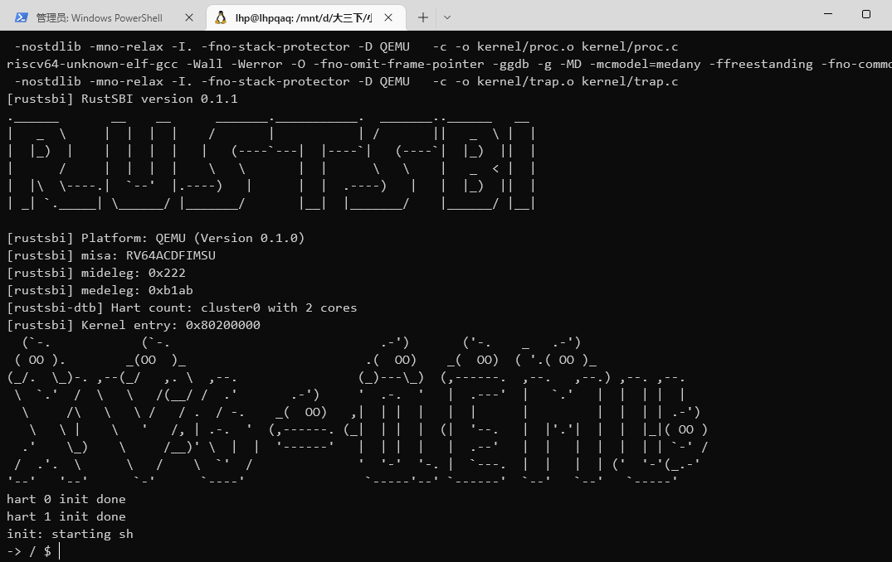
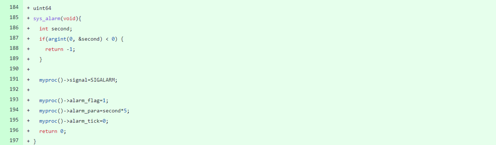
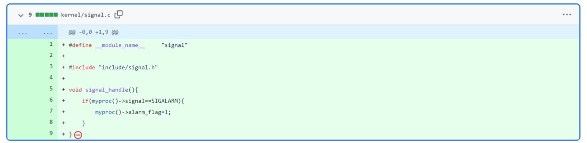

# 开发日志

小组成员：刘昊鹏 陈旭 王江涛

## 任务0：前导

> 2022-06-22

#### 配置环境

- 首先在 GitHub fork [xv6-k210](https://github.com/abrasumente233/xv6-k210) 项目；

- 安装环境依赖

  `sudo apt update && sudo apt install gcc-riscv64-unknown-elf` 安装64位 RISC-V 的编译器。

  `sudo apt install qemu-system-misc` ，安装 RISC-V 的 QEMU模拟器

  `sudo apt install python3` ，安装python3，因为我们的测试脚本是用 Python 写的；

  `sudo apt install dosfstools` ，安装 mkfs.vfat 工具；

- 运行

  `make fs` 生成一个 FAT32 的文件系统镜像，并将它保存在 `fs.img` ;

  修改makefile第一行，运行平台为qemu

  ```makefile
  #platform	:= k210
  platform	:= qemu
  ```

  `make run` ，在 QEMU 上运行 xv6-k210：

  

  
  
  ## 任务1：实现进程相关的系统调用
  
  > 2022-06-22 上午
  
  阅读代码和xv6的相关资料
  
  1. xv6 手册: https://pdos.csail.mit.edu/6.828/2018/xv6/book-rev11.pdf ，以及其中文译本： https://th0ar.gitbooks.io/xv6-chinese/content/
  2. build a OS（关于 xv6 的笔记）：https://xiayingp.gitbook.io/build_a_os/
  
  搜索在xv6中添加新的系统调用的方法
  
  >  2022-06-22 下午
  
  - 在xv6-user目录下
  
    - 在user.h文件中，添加新系统调用封装后的函数声明，假设其函数名为`getppid`。
  
      - ```c
        int getppid(void);
        ```
  
    - 在usys.pl文件末尾，添加如下行：
  
      - ```perl
        entry("getppid");
        ```
  
  - 在kernel目录下
  
    - 在include/sysnum.h文件中，添加新系统调用号的宏定义：
  
      - ```c
        #define SYS_getppid     27
        ```
  
      - 其中，27为新的合法系统调用号
  
    - 在syscall.c文件中，添加功能函数的声明，并更新系统调用表：
  
      - ```c
        extern uint64 sys_getppid(void);
        
        static uint64 (*syscalls[])(void) = {
            ......
            [SYS_getppid]    sys_getppid,
        };
        
        static char *sysnames[] = {
            ......
            [SYS_getppid]     "getppid",
        };
        ```
  
    - 在sysproc.c文件中，实现`sys_getppid`函数的功能如下：
  
      - ```c
        uint64 sys_getppid(void)
        {
          return myproc()->parent->pid;
        }
        ```
  
  - 在xv6-user目录下
  
    - 创建getppid.c文件，编写系统调用`getppid`的测试函数`test_getppid`如下：
  
      ```c
      int test_getppid()
      {
          //TEST_START(__func__);
          int pid = getppid();
          //assert(pid >= 0);
          printf("getppid success.\nppid = %d\n", pid);
          //TEST_END(__func__);
          return 0;
      }
      ```
    
  - 在根目录下
  
    - 在Makefile文件中加一行如下：
  
      ```makefile
      UPROGS=\
          $U/_init\
          $U/_sh\
          $U/_cat\
          ...
          $U/_getppid\
      ```

​	运行结果

​	

> 2022-06-23


## 任务2：添加信号

#### 系统调用：`alarm`

> 2022-06-24

首先要在进程结构体里增加条目，alarm_flag用以代指该进程被alarm信号标记，alarm_tick和alarm_para分别代表当前运行时间与限定运行时间


在sysproc.c中完成sys_alarm，在用户态调用alarm函数时，使用argint读取参数，修改当前进程的各个变量



增加signal.c文件，signal_handle函数用以处理当前进程捕获的信号。如检测到当前信号为SIGALARM(在signal.h中定义的宏)，则将alarm标记位赋值为1



在timer.c的timer_tick函数中增加以下内容，代表当前进程如果被标记为alarm_flag，那么就累加alarm_tick，直到和alarm_para相等，kill此进程


#### 系统调用：`pause`

> 2022-06-24

当用户态调用pause函数时，直接使该进程sleep


#### 系统调用：`signal` 第一步

> 2022-06-27

首先需要在signal.h中扩展信号，增加SIG_IGN和SIG_DFL


proc.h中增加新条目，表示当前进程接收到的信号之后的操作


与此同时扩展signal_handle函数，如果当前行为为SIG_DFL就立即kill(相当于调用alarm(0))，如果为SIG_IGN就忽略，否则视为调用alarm

 ```c
 void sighandle(void)
 {
     struct proc *p = myproc();
     int signum = p->killed;
     int i = 0;
     for(i=0;i<2;i++){
         if(signum == p->sigact[i].sig){
             if(p->sigact[i].handler == SIG_DEF){
                 exit(-1);
             }else if(p->sigact[i].handler == SIG_IGN){
                 p->killed = 0;
                 break;
             }else{	//step2
             }
         }
     }
 }
 ```

> 2022-06-28

在proc.h文件的proc结构体中添加成员变量如下，并在proc.c中进程初始化时进行初始化。

```c
//signal，本实验只要求实现两种信号及其处理，因此声明数组大小为2
struct sigaction sigact[2];
```

```c
void procinit(){
    ...
        p->sigact[0].sig = SIGALRM;
    p->sigact[0].handler = SIG_DEF;
    p->sigact[1].sig = SIGINT;
    p->sigact[1].handler = SIG_DEF;
    ...
}
```

在sysproc.c文件中，实现`sys_signal`函数的功能如下

```c
uint64 sys_signal(void)
{
    uint64 sig;
    func handler;
    if (argaddr(0, &sig) < 0 || argaddr(1, (uint64*)&handler) < 0) {
        return -1;
    }
    //printf("signal:%d,%d\n",sig,handler);
    struct proc* p = myproc();
    int i = 0;
    for(i=0;i<2;i++){
        if(sig == p->sigact[i].sig){
            p->sigact[i].handler = handler;
            break;
        }
    }
    return 0;
}
```

在proc.c文件的usertrap函数中修改对信号的处理如下

```c
void usertrap(void)
{
    ...
        if(r_scause() == 8){
            if(p->killed == SIGTERM)
                exit(-1);
            ...
        } 
    else if((which_dev = devintr()) != 0){
        ...
    } 
    else {
        ...
            p->killed = SIGTERM;
    }
    if(p->killed){
        if(p->killed == SIGTERM)
            exit(-1);
        sighandle();
    }
    ...
}
```

在xv6-user目录下

创建alarmtest2.c文件，编写系统调用`alarm`的测试函数`test_alarm`如下：

```c
int test_alarm()
{
  printf("Alarm testing!\n");
  alarm (5);
  printf("Waiting for alarm to go off\n");
  (void) signal ( SIGALRM, SIG_DEF ); //test1
  //(void) signal ( SIGALRM, SIG_IGN ); //test2
  pause();      //process suspended, waiting for signals to wake up
  printf("now reachable!\n");
  return 0;
}
```

在根目录下

在Makefile文件中如下编译目标：

```makefile
UPROGS=\
    $U/_init\
    $U/_sh\
    $U/_cat\
    ...
    $U/_alarmtest2\
```

#### 系统调用：`signal` 第二步

> 2022-06-29

在kernel目录下

在signal.c中修改`sighandle`函数的定义，修改`p->trapframe->epc`，当进程返回用户态时首先执行信号处理函数，下一次陷入内核时通过`r_sepc()`恢复到原来的epc。

```c
void sighandle(void)
{
	struct proc *p = myproc();
	int signum = p->killed;
	int i = 0;
	for(i=0;i<2;i++){
		if(signum == p->sigact[i].sig){
			if(p->sigact[i].handler == SIG_DEF){
                exit(-1);
			}else if(p->sigact[i].handler == SIG_IGN){
                p->killed = 0;
				break;
			}else{	//step2
                //当进程返回用户态时，从epc所指向的地址处开始执行，并通过a0传递处理函数的参数
                p->trapframe->epc = (uint64)p->sigact[i].handler;
                p->trapframe->a0 = p->killed;
				p->killed = 0;
            }
		}
	}
}
```

在xv6-user目录下

创建alarmtest3.c文件，编写系统调用`alarm`的测试函数`test_alarm`如下：

```c
void ding (int sig)
{
  printf("[%d] Alarm has gone off\n",sig);
}
int test_alarm()
{
  printf("Alarm testing!\n");
  alarm (5);
  printf("Waiting for alarm to go off\n");
  (void) signal ( SIGALRM, ding );
  pause();      //process suspended, waiting for signals to wake up
  printf("now reachable!\n");
  return 0;
}
```

在根目录下

在Makefile文件中如下编译目标：

```makefile
UPROGS=\
    $U/_init\
    $U/_sh\
    $U/_cat\
    ...
    $U/_alarmtest3\
```

#### 系统调用：kill

> 2022-06-30

在kernel目录下

在proc.h文件中修改`kill(int)`函数声明，并在proc.c文件中修改该函数的定义。

```c
//proc.h
int             kill(int,int);
//proc.c
int kill(int pid, int sig)
{
  ...
      p->killed = sig;
  ...
}
```

在sysproc.c文件中修改系统调用`sys_kill()`函数的的定义

```c
uint64 sys_kill(void)
{
  int pid,sig;
  if(argint(0, &pid) < 0 || argint(0, &sig) < 0)
    return -1;
  return kill(pid,sig);
}
```

修改该目录下所有文件中的`kill()`调用

在xv6-user目录下

在user.h文件中，修改kill系统调用封装后的函数声明

```c
int kill(int pid,int sig);
```

修改kill的测试函数以及该目录下其他文件中的`kill()`调用

```c
#include "kernel/include/signal.h"
...
int main(int argc, char **argv)
{
  ...
    kill(atoi(argv[i]),SIGTERM);
  ...
}
```

#### 按下CTRL-C 向前台进程发送 SIGINT 信号

> 2022-06-30

在kernel目录下

在proc.h文件中增加`procint()`函数声明，并在proc.c文件中增加该函数的定义。

如果是后台进程，sh程序在调用exec执行程序时会调用两次fork，通过子进程的子进程来执行程序，同时第一次的fork的子进程再fork第二个子进程后会直接退出，这是执行程序的子进程交由操作系统来管理，因此当前子进程的父进程是操作系统，其ppid值是1。而前台进程由于是通过第一次fork的子进程，其ppid值为sh的pid值。据此可以在按下Crtl-C时杀掉前台进程。

```c
void procint(void)
{
  int flag = 0;
  struct proc *p;
  for(p = proc; p < &proc[NPROC]; p++){
      if(p->pid > 2 && p->parent->pid == 2 ){ 
        if(p->state == RUNNING || p->state == RUNNABLE || p->state == SLEEPING){
          kill(p->pid,SIGINT);
          flag = 1;
        }
      }
  }
  if(!flag){
    printf("\n-> / $ ");
  }
}
```

在console.c文件中修改`consoleintr()`函数，添加对硬件中断`Ctrl-C`的处理。

```c
void consoleintr(int c)
{
  ...
  switch(c){
  case C('C'):
    procint();
    break;
  ...
  }
}
```
