# 实验报告

[TOC]

## 小组成员及分工

**日志与实验报告由所有成员共同完成，实验思路等由所有成员共同谈论完成，以下主要为编写代码的分工**

刘昊鹏（201907040101）：主要负责任务三与任务四，以及任务一，任务三与任务四的验收

陈旭（201914020128）：主要负责任务二与任务二的验收

王江涛（201908010312）：主要负责任务一

## 实验目的

实验最终的目的为实现xv6下的ps程序，细分为以下几个子任务

- 任务0：前导，安装配置相关环境
- 任务1：实现进程相关的系统调用
  - 系统调用 #1：`getppid`
  - 系统调用 #2：`times` 获取进程的用户和系统时间
  - 系统调用 #3：`getmem`
- 任务2：添加信号
  - 系统调用：`alarm`
  - 系统调用：`pause`
  - 系统调用：`signal` 第一步
  - 系统调用：`signal` 第二步
  - 系统调用：`kill`
  - 按下`CTRL-C` 向前台进程发送` SIGINT `信号
- 任务3：实现虚拟文件系统 `/proc`
  - 虚拟目录列表
  - ls /proc
  - cat /proc
  - Bonus：自动创建 /proc 目录并挂载 proc
- 任务4：实现 `ps` 命令

## 实验设计思想和流程

### 任务0：前导

#### 配置环境

- 首先在 GitHub fork [xv6-k210](https://github.com/abrasumente233/xv6-k210) 项目；

- 安装环境依赖

  `sudo apt update && sudo apt install gcc-riscv64-unknown-elf` 安装64位 RISC-V 的编译器。

  `sudo apt install qemu-system-misc` ，安装 RISC-V 的 QEMU模拟器

  `sudo apt install python3` ，安装python3，因为我们的测试脚本是用 Python 写的；

  `sudo apt install dosfstools` ，安装 mkfs.vfat 工具；

- 运行

  `make fs` 生成一个 FAT32 的文件系统镜像，并将它保存在 `fs.img` ;

  修改makefile第一行，运行平台为qemu

  ```makefile
  #platform	:= k210
  platform	:= qemu
  ```

  `make run` ，在 QEMU 上运行 xv6-k210：

  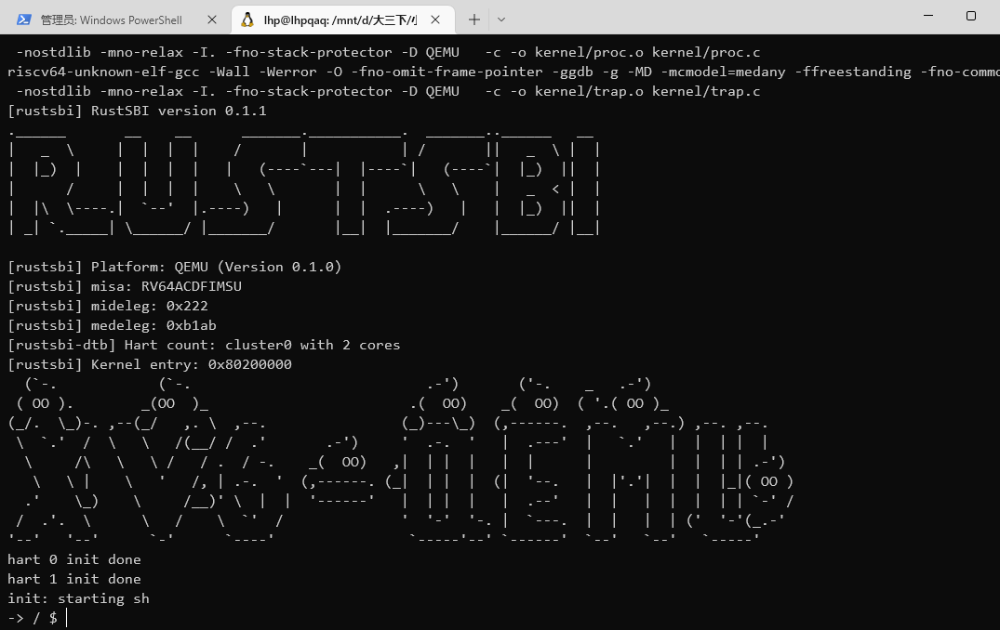

### 任务1：实现进程相关的系统调用

- xv6-user

  - 在user.h中，添加新系统调用封装后的函数声明。

    - ```c
      int getppid(void);
      ```

  - 在usys.pl添加：

    - ```perl
      entry("getppid");
      ```

- kernel

  - 在sysnum.h中，添加新系统调用号：

    - ```c
      #define SYS_getppid     27
      ```

  - 在syscall.c中，添加功能函数的声明，并更新系统调用表：

    - ```c
      extern uint64 sys_getppid(void);
      
      static uint64 (*syscalls[])(void) = {
          ......
          [SYS_getppid]    sys_getppid,
      };
      
      static char *sysnames[] = {
          ......
          [SYS_getppid]     "getppid",
      };
      ```

  - 在sysproc.c中，实现`sys_getppid`：

    - ```c
      uint64 sys_getppid(void)
      {
        return myproc()->parent->pid;
      }
      ```

- 在xv6-user目录下

  - 创建getppid.c文件，编写系统调用`getppid`的测试函数`test_getppid`如下：

    ```c
    int test_getppid()
    {
        //TEST_START(__func__);
        int pid = getppid();
        //assert(pid >= 0);
        printf("getppid success.\nppid = %d\n", pid);
        //TEST_END(__func__);
        return 0;
    }
    ```

- 在根目录下

  - 在Makefile文件中加一行如下：

    ```makefile
    UPROGS=\
        $U/_init\
        $U/_sh\
        $U/_cat\
        ...
        $U/_getppid\
    ```

#### 系统调用 #2：times 获取进程的用户和系统时间

为每个进程维护一个tms结构体

```C
struct tms {
    uint64 utime; // user time (in seconds)
    uint64 stime; // system time
    uint64 cutime; // user time of children
    uint64 cstime; // system time of children
};
```

在proc结构体中新增两个成员，分别表示进程上次从用户态转为内核态和从内核态转为用户态的时间

```C
  struct tms times;
  uint64 u2stime;
  uint64 s2utime;
```

封装一个函数，用于返回当前时间，可以选择使用r_time还是ticks

```C
uint64 retime()
{
    uint64 now;

    if(WHATIME)
    {
        now = r_time();
    }
    else
    {
        acquire(&tickslock);
        now = ticks;
        release(&tickslock);
    }
    return now;
}
```

在trap.c和proc.c等进程状态切换的位置，更新这些成员

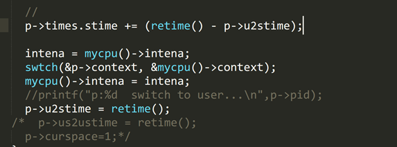

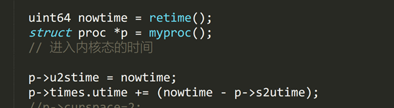

在进程回收前，更新其父进程的cstime和ustime成员

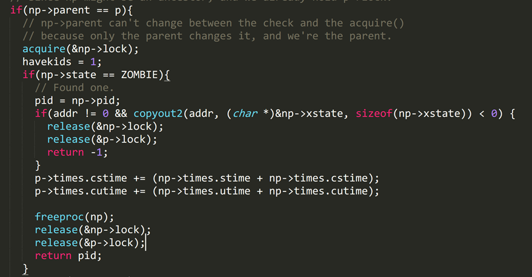

#### 系统调用 #3：getmem

getmem() 以 KiB（1024字节）为单位返回进程的虚拟内存大小。

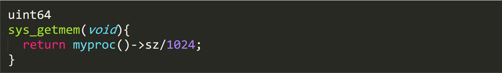

### 任务2：添加信号

#### 系统调用：`alarm`

首先要在进程结构体里增加条目，alarm_flag用以代指该进程被alarm信号标记，alarm_tick和alarm_para分别代表当前运行时间与限定运行时间

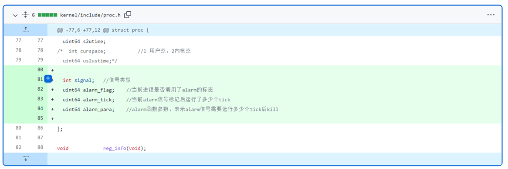

在sysproc.c中完成sys_alarm，在用户态调用alarm函数时，使用argint读取参数，修改当前进程的各个变量

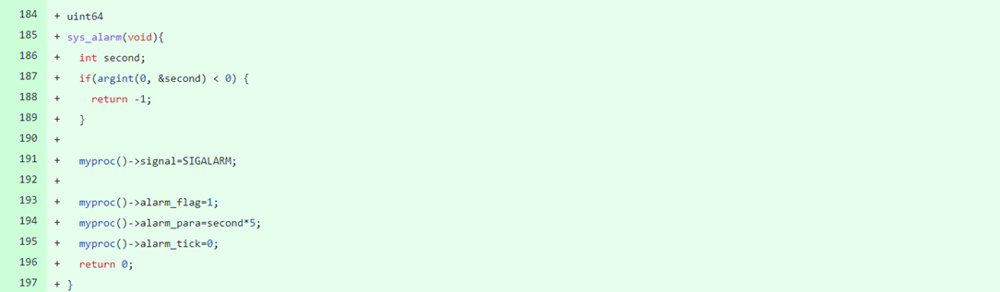

增加signal.c文件，signal_handle函数用以处理当前进程捕获的信号。如检测到当前信号为SIGALARM(在signal.h中定义的宏)，则将alarm标记位赋值为1

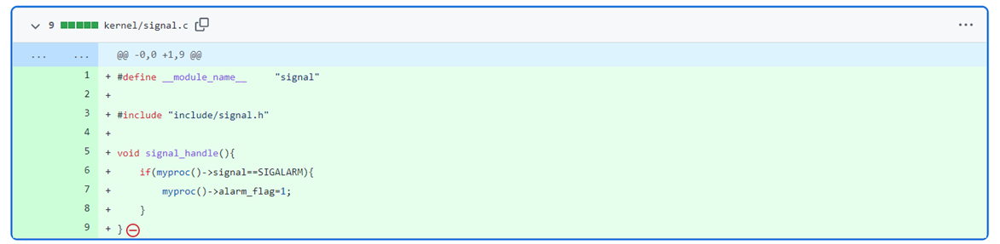

在timer.c的timer_tick函数中增加以下内容，代表当前进程如果被标记为alarm_flag，那么就累加alarm_tick，直到和alarm_para相等，kill此进程

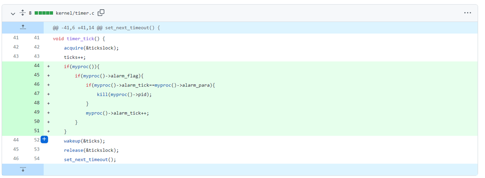

#### 系统调用：`pause`

当用户态调用pause函数时，直接使该进程sleep

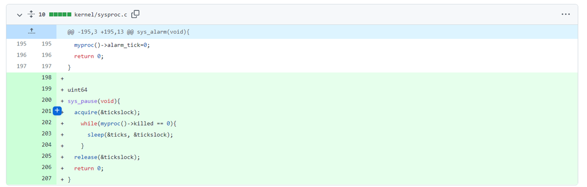


#### 系统调用：`signal` 第一步

首先需要在signal.h中扩展信号，增加SIG_IGN和SIG_DFL

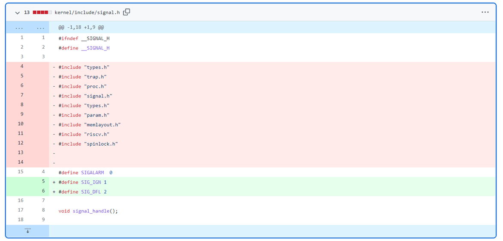

proc.h中增加新条目，表示当前进程接收到的信号之后的操作

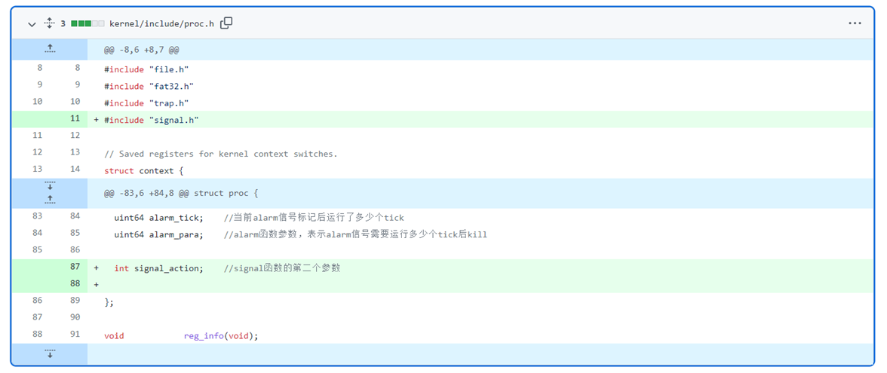

与此同时扩展signal_handle函数，如果当前行为为SIG_DFL就立即kill(相当于调用alarm(0))，如果为SIG_IGN就忽略，否则视为调用alarm

 ```c
void sighandle(void)
{
    struct proc *p = myproc();
    int signum = p->killed;
    int i = 0;
    for(i=0;i<2;i++){
        if(signum == p->sigact[i].sig){
            if(p->sigact[i].handler == SIG_DEF){
                exit(-1);
            }else if(p->sigact[i].handler == SIG_IGN){
                p->killed = 0;
                break;
            }else{	//step2
            }
        }
    }
}
 ```

在proc.h文件的proc结构体中添加成员变量如下，并在proc.c中进程初始化时进行初始化。

```c
//signal，本实验只要求实现两种信号及其处理，因此声明数组大小为2
struct sigaction sigact[2];
```

```c
void procinit(){
    ...
        p->sigact[0].sig = SIGALRM;
    p->sigact[0].handler = SIG_DEF;
    p->sigact[1].sig = SIGINT;
    p->sigact[1].handler = SIG_DEF;
    ...
}
```

在sysproc.c文件中，实现`sys_signal`函数的功能如下

```c
uint64 sys_signal(void)
{
    uint64 sig;
    func handler;
    if (argaddr(0, &sig) < 0 || argaddr(1, (uint64*)&handler) < 0) {
        return -1;
    }
    //printf("signal:%d,%d\n",sig,handler);
    struct proc* p = myproc();
    int i = 0;
    for(i=0;i<2;i++){
        if(sig == p->sigact[i].sig){
            p->sigact[i].handler = handler;
            break;
        }
    }
    return 0;
}
```

在proc.c文件的usertrap函数中修改对信号的处理如下

```c
void usertrap(void)
{
    ...
        if(r_scause() == 8){
            if(p->killed == SIGTERM)
                exit(-1);
            ...
        } 
    else if((which_dev = devintr()) != 0){
        ...
    } 
    else {
        ...
            p->killed = SIGTERM;
    }
    if(p->killed){
        if(p->killed == SIGTERM)
            exit(-1);
        sighandle();
    }
    ...
}
```

在xv6-user目录下

创建alarmtest2.c文件，编写系统调用`alarm`的测试函数`test_alarm`如下：

```c
int test_alarm()
{
  printf("Alarm testing!\n");
  alarm (5);
  printf("Waiting for alarm to go off\n");
  (void) signal ( SIGALRM, SIG_DEF ); //test1
  //(void) signal ( SIGALRM, SIG_IGN ); //test2
  pause();      //process suspended, waiting for signals to wake up
  printf("now reachable!\n");
  return 0;
}
```

在根目录下

在Makefile文件中如下编译目标：

```makefile
UPROGS=\
    $U/_init\
    $U/_sh\
    $U/_cat\
    ...
    $U/_alarmtest2\
```

#### 系统调用：`signal` 第二步

在kernel目录下

在signal.c中修改`sighandle`函数的定义，修改`p->trapframe->epc`，当进程返回用户态时首先执行信号处理函数，下一次陷入内核时通过`r_sepc()`恢复到原来的epc。

```c
void sighandle(void)
{
	struct proc *p = myproc();
	int signum = p->killed;
	int i = 0;
	for(i=0;i<2;i++){
		if(signum == p->sigact[i].sig){
			if(p->sigact[i].handler == SIG_DEF){
                exit(-1);
			}else if(p->sigact[i].handler == SIG_IGN){
                p->killed = 0;
				break;
			}else{	//step2
                //当进程返回用户态时，从epc所指向的地址处开始执行，并通过a0传递处理函数的参数
                p->trapframe->epc = (uint64)p->sigact[i].handler;
                p->trapframe->a0 = p->killed;
				p->killed = 0;
            }
		}
	}
}
```

在xv6-user目录下

创建alarmtest3.c文件，编写系统调用`alarm`的测试函数`test_alarm`如下：

```c
void ding (int sig)
{
  printf("[%d] Alarm has gone off\n",sig);
}
int test_alarm()
{
  printf("Alarm testing!\n");
  alarm (5);
  printf("Waiting for alarm to go off\n");
  (void) signal ( SIGALRM, ding );
  pause();      //process suspended, waiting for signals to wake up
  printf("now reachable!\n");
  return 0;
}
```

在根目录下

在Makefile文件中如下编译目标：

```makefile
UPROGS=\
    $U/_init\
    $U/_sh\
    $U/_cat\
    ...
    $U/_alarmtest3\
```

#### 系统调用：kill

在kernel目录下

在proc.h文件中修改`kill(int)`函数声明，并在proc.c文件中修改该函数的定义。

```c
//proc.h
int             kill(int,int);
//proc.c
int kill(int pid, int sig)
{
  ...
      p->killed = sig;
  ...
}
```

在sysproc.c文件中修改系统调用`sys_kill()`函数的的定义

```c
uint64 sys_kill(void)
{
  int pid,sig;
  if(argint(0, &pid) < 0 || argint(0, &sig) < 0)
    return -1;
  return kill(pid,sig);
}
```

修改该目录下所有文件中的`kill()`调用

在xv6-user目录下

在user.h文件中，修改kill系统调用封装后的函数声明

```c
int kill(int pid,int sig);
```

修改kill的测试函数以及该目录下其他文件中的`kill()`调用

```c
#include "kernel/include/signal.h"
...
int main(int argc, char **argv)
{
  ...
    kill(atoi(argv[i]),SIGTERM);
  ...
}
```

#### 按下CTRL-C 向前台进程发送 SIGINT 信号

在kernel目录下

在proc.h文件中增加`procint()`函数声明，并在proc.c文件中增加该函数的定义。

如果是后台进程，sh程序在调用exec执行程序时会调用两次fork，通过子进程的子进程来执行程序，同时第一次的fork的子进程再fork第二个子进程后会直接退出，这是执行程序的子进程交由操作系统来管理，因此当前子进程的父进程是操作系统，其ppid值是1。而前台进程由于是通过第一次fork的子进程，其ppid值为sh的pid值。据此可以在按下Crtl-C时杀掉前台进程。

```c
void procint(void)
{
  int flag = 0;
  struct proc *p;
  for(p = proc; p < &proc[NPROC]; p++){
      if(p->pid > 2 && p->parent->pid == 2 ){ 
        if(p->state == RUNNING || p->state == RUNNABLE || p->state == SLEEPING){
          kill(p->pid,SIGINT);
          flag = 1;
        }
      }
  }
  if(!flag){
    printf("\n-> / $ ");
  }
}
```

在console.c文件中修改`consoleintr()`函数，添加对硬件中断`Ctrl-C`的处理。

```c
void consoleintr(int c)
{
  ...
  switch(c){
  case C('C'):
    procint();
    break;
  ...
  }
}
```


### 任务3：实现虚拟文件系统 `/proc`

#### 虚拟目录列表

利用  `mkdir` 创建目录 `/proc` ，当执行 `ls /proc` 时，将会出现一系列虚拟目录（并不真正存储在磁盘上）。每一个正在运行的进程都拥有自己的目录。

在 xv6 中，一个文件即为一个 `inode` ，`inode` 中含有读写文件内容以及构成 `inode` 数据的函数。这些 `inode` 函数将会调用硬件接口，但事实上`/proc` 在磁盘上并不存在。

所以我们需要修改文件系统相关的代码。更具体地说，现在 `struct inode`  中包含一个叫做 `struct inode_functions` 的指针，其中包含指向读写 `inode` 的函数指针。这里将提供一个 `/proc` inode 的实现。

```c
struct inode_functions {
  void (*ipopulate)(struct inode*);                   // fill in inode details
  void (*iupdate)(struct inode*);                     // write inode details back to disk
  int (*readi)(struct inode*, char*, uint, uint);     // read from file contents
  int (*writei)(struct inode*, char*, uint, uint);    // write to file contents
};

struct inode {
  /// ... other fields ...
  struct inode_functions *i_func; // NEW!
};
```

首先修改 inode 中 的 `i_func` 指针，以便读取 `/proc` 时函数能够被调用。从 `ls.c` 可以观察到如何获取目录列表，然后便可以写一个 `procfs_readi` 函数。`namei` 函数根据给定的文件路径（利用参数进行传递）返回对应的 `struct inode*` 。

需要确保 `ls /proc` 显示正确的文件类型和大小。因此需要实现 `procfs_ipopulate` ，注意此处的`iget()` ：对于 “proc” 文件使用不同的设备号来避免重复获取错误的 inode。

追溯mkdir的流程，定位到sys_mkdir，添加新建/proc时的处理的，既`createproc()`函数

```C
uint64
sys_mkdir(void)
{
  char path[FAT32_MAX_PATH];
  struct dirent *ep;
  char* proc = "/proc";
  char* proc1 = "proc";
  if(argstr(0, path, FAT32_MAX_PATH) < 0 || (ep = create(path, T_DIR, 0)) == 0)
  {
    return -1;
  }
  if (strncmp(proc, path, 5) == 0 || strncmp(proc1, path, 4)==0) 
  {
      eunlock(ep);
      eput(ep);
      createproc(); //创建进程信息
      return 0;
  }
  eunlock(ep);
  eput(ep);
  return 0;
}
```

添加`createproc()`函数：

```C
void createproc()
{
    struct dirent* ep = ename("/proc");
    elock(ep);
    ep->e_func = &procfs_e_func;
    struct proc* p;
    struct dirent* tep;
    char pdir[20];
    for (p = proc; p < &proc[NPROC]; p++) 
    {
        itoa(p->pid, pdir);
        if (p->state != UNUSED) 
        {
            tep = ealloc_inmemory(ep, pdir, ATTR_DIRECTORY);    //pid dir
            ealloc_inmemory(tep, "stat", ATTR_ARCHIVE);         // stat
        }
    }
    eunlock(ep);
}
```

添加` ealloc_inmemory`函数，既在内存上分配进程信息文件：

```C
struct dirent *ealloc_inmemory(struct dirent *dp, char *name, int attr)
{
    if (!(dp->attribute & ATTR_DIRECTORY)) 
    {
        panic("ealloc not dir");
    }
    if (dp->valid != 1 || !(name = formatname(name))) 
    { 
        return NULL;
    }
    struct dirent *ep;
    uint off = 0;
    if ((ep = dirlookup(dp, name, &off)) != 0) 
    {   
        return ep;
    }
    ep = eget(dp, name);
    elock(ep);
    ep->attribute = attr;
    ep->file_size = 0;
    ep->first_clus = 0;
    ep->parent = edup(dp);
    ep->off = off;
    ep->clus_cnt = 0;
    ep->cur_clus = 0;
    ep->dirty = 0;
    strncpy(ep->filename, name, FAT32_MAX_FILENAME);
    ep->filename[FAT32_MAX_FILENAME] = '\0';
    if (attr == ATTR_DIRECTORY) 
    {   
        ep->attribute |= ATTR_DIRECTORY;
    } 
    else 
    {
        ep->attribute |= ATTR_ARCHIVE;
    }
    ep->valid = 1;
    eunlock(ep);
    return ep;
}
```

#### ls /proc

修改dirnext函数，在执行ls /proc或ls /proc/[pid]时，实时打印出当前的进程信息

```C
int dirnext(struct file *f, uint64 addr)
{
  if(f->readable == 0 || !(f->ep->attribute & ATTR_DIRECTORY))
    return -1;
  struct dirent de;
  struct stat st;
  int count = 0;
  int ret;
  elock(f->ep);
  while ((ret = enext(f->ep, &de, f->off, &count)) == 0) {  // skip empty entry
    f->off += count * 32;
  }
  eunlock(f->ep);
  if (ret != -1)
  {
    f->off += count * 32;
    estat(&de, &st);
  }
  else
  {
    if(strncmp(f->ep->filename, "proc", 4) == 0 || strncmp(f->ep->parent->filename, "proc", 4) == 0)
    {
      struct dirent* en;
      elock(f->ep);
      if((en = procfs_enext(f->ep)) != NULL)
      {
        f->ep->child_index++;
      }
      else
      {
        f->ep->child_index = 0;
        eunlock(f->ep);
        return 0;
      }
      eunlock(f->ep);
      estat(en,&st);
    }
    else
    {
      return 0;
    }
  }
  if(copyout2(addr, (char *)&st, sizeof(st)) < 0)
    return -1;
  return 1;
}
```

#### cat /proc

在fat32.h中新增定义结构体dirent_function，并在结构体dirent中增加成员变量e_func，然后在file.c中修改系统中对eread的调用。

fat32.c中在文件系统初始化或分配dirent时初始化dirent的e_func。使用 tmp->e_func = &procfs_e_func; 语句在为/proc目录下的子目录或文件分配dirent时重定向e_func。

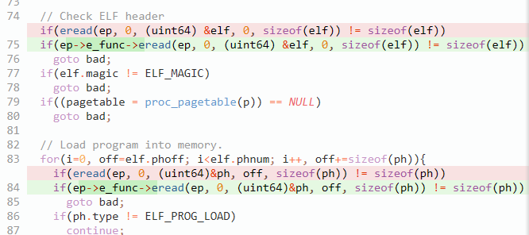

在fat32.c中实现procfs_eread函数

```C
int procfs_eread(struct dirent *entry, int user_dst, uint64 dst, uint off, uint n)
{
    if (off > entry->file_size || off + n < off || (entry->attribute & ATTR_DIRECTORY)) {
        return 0;
    }
    int pid = 0;
    int len = 0;
    pid = atoi(entry->parent->filename);
    if(pid > 0)
    {
        char buf[512];
        proc_read(pid,buf);
        len = strlen(buf);
        either_copyout(user_dst,dst,buf,len);
    }
    return len;
}
```

在proc.c中实现辅助函数proc_read，获取到所读取的进程的信息，处理成特定的字符串，作为stat的内容

```C
void proc_read(int pid, char* s)
{
  struct proc *p;
  for(p = proc; p < &proc[NPROC]; p++) {
    if(pid == p->pid)
    {
      break;
    }
  }
  s[0] = '\0';
  strcat(s,"pid\tcommand\t\tstate\t\tppid\tutime\tstime\tcutime\tcstime\tvsz\n");
  char tmp[128];
  itoa(p->pid,tmp);
  strcat(s,tmp);
  strcat(s,"\t");
  strcat(s,p->name);
  strcat(s,"\t\t");
  if(p->state == UNUSED)
  {
    strcat(s,"UNUSED\t\t");
  }
  else if(p->state == SLEEPING)
  {
    strcat(s,"SLEEPING\t");
  }
  else if(p->state == RUNNABLE)
  {
    strcat(s,"RUNNABLE\t");
  }
  else if(p->state == RUNNING)
  {
    strcat(s,"RUNNING \t");
  }
  else
  {
    strcat(s,"ZOMBIE\t\t");
  }
  if(p->pid == 1)
    p->parent->pid = 0;
  itoa(p->parent->pid,tmp);
  strcat(s,tmp);
  strcat(s,"\t");
  itoa(p->times.utime,tmp);
  strcat(s,tmp);
  strcat(s,"\t");
  itoa(p->times.stime,tmp);
  strcat(s,tmp);
  strcat(s,"\t");
  itoa(p->times.cutime,tmp);
  strcat(s,tmp);
  strcat(s,"\t");
  itoa(p->times.cstime,tmp);
  strcat(s,tmp);
  strcat(s,"\t");
  itoa(p->sz,tmp);
  strcat(s,tmp);
  strcat(s,"\n");
}
```

### 任务4：实现 `ps` 命令

通过增加系统调用，返回ps命令执行时系统中正在运行的进程信息。

在进程控制结构体中增加成员变量starttime，用于记录进程被创建并开始运行的系统时间

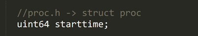

进程被创建时，记录当前时间

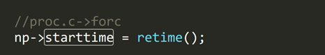

调用ps时，计算当前运行的时间

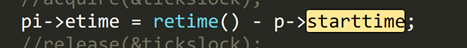

实现proc_ps用于读取指定pid的进程的信息到procinfo结构体

```C
void proc_ps(int pid, struct procinfo* pi)
{
  struct proc *p;
  for(p = proc; p < &proc[NPROC]; p++) 
  {
    if(pid == p->pid)
    {
      break;
    }
  }
  pi->pid = p->pid;
  pi->ppid = p->parent->pid;
  if(p->pid == 1)
    pi->ppid = 0;
  pi->command[0] = '\0';
  strcat(pi->command, p->name);
  if(p->state == SLEEPING)
  {
    pi->state = 'S';
  }
  else
  {
    pi->state = 'R';
  }
  uint64 maxt = p->u2stime;
  if(p->s2utime>maxt)
    maxt = p->s2utime;
  pi->times = p->times.stime + p->times.utime;
  pi->etime = retime() - p->starttime;
  pi->vsz = p->sz;
}
```

在sysproc.c文件中，实现sys_procps函数系统调用，把procinfo中的信息给用户态

```C
uint64 sys_procps(void)
{
  uint64 addr;
  if(argaddr(0, &addr) < 0)
    return -1;
  int pids[NPROC];
  struct procinfo pinfo[NPROC];
  int i;
  uint64 len = 0;
  int cnt = getPids(pids);
  for(i = 0; i < cnt; i++)
  {
    proc_ps(pids[i],&pinfo[i]);
    len += sizeof(pinfo[i]);
  }
  copyout2(addr,(char*)pinfo,len);
  return cnt;
}
```

#### Bonus：自动创建 /proc 目录并挂载 proc

Xv6执行的第一个进程为init，在init中添加创建mkdir的命令，即可实现自动挂载

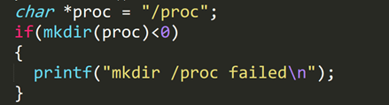

## 主要数据结构及符号说明

### 进程相关

#### struct proc

```C
struct proc {
  struct spinlock lock;
  // p->lock must be held when using these:
  enum procstate state;        // Process state
  struct proc *parent;         // Parent process
  void *chan;                  // If non-zero, sleeping on chan
  int killed;                  // If non-zero, have been killed
  int xstate;                  // Exit status to be returned to parent's wait
  int pid;                     // Process ID
  // these are private to the process, so p->lock need not be held.
  uint64 kstack;               // Virtual address of kernel stack
  uint64 sz;                   // Size of process memory (bytes)
  pagetable_t pagetable;       // User page table
  pagetable_t kpagetable;      // Kernel page table
  struct trapframe *trapframe; // data page for trampoline.S
  struct context context;      // swtch() here to run process
  struct file *ofile[NOFILE];  // Open files
  struct dirent *cwd;          // Current directory
  char name[16];               // Process name (debugging)
  int tmask;                    // trace mask

  struct tms times;
  uint64 u2stime;		//进程上次从用户态转为内核态的时间
  uint64 s2utime;		//进程上次从内核态转为用户态的时间
  uint64 starttime;		//进程开始时的时间

  int signal;   		//信号类型
  uint64 alarm_flag;    //当前进程是否调用了alarm的标志
  uint64 alarm_tick;    //当前alarm信号标记后运行了多少个tick
  uint64 alarm_para;    //alarm函数参数，表示alarm信号需要运行多少个tick后kill

  struct sigaction sigaction;         //信号类型

};
```

#### tms

```C
struct tms {
	uint64 utime;		// 用户时间
	uint64 stime;		// 系统时间
	uint64 cutime;		// 子进程的用户时间
	uint64 cstime;		// 子进程的系统时间
}

struct tms t;
clock_t ticks = times(&t);
```

`utime` 为当前进程的 CPU 时间，`stime` 为内核为当前进程执行任务所用的 CPU 时间。

`cutime` 为 `utime` 和所有等待被终止的子进程的 `cutime` 之和。`cstime` 为 `stime` 和所有等待被终止的子进程的 `cstime` 之和。

### 文件系统

#### dirent

```C
struct dirent {
    char  filename[FAT32_MAX_FILENAME + 1];
    uint8   attribute;
    uint32  first_clus;
    uint32  file_size;
    uint32  cur_clus;
    uint    clus_cnt;
    /* for OS */
    uint8   dev;
    uint8   dirty;
    short   valid;
    int     ref;
    uint32  off;            // offset in the parent dir entry, for writing convenience
    struct dirent *parent;  // because FAT32 doesn't have such thing like inum, use this for cache trick
    struct dirent *next;
    struct dirent *prev;
    struct sleeplock    lock;

    struct dirent_functions *e_func;		//文件调用相关函数
};
```

```C
struct dirent_functions {  
    int (*eread)(struct dirent*, int, uint64, uint, uint);     // read from file contents
}; 
```

新增定义结构体`dirent_function`，并在结构体dirent中增加成员变量`e_func`，然后修改系统中对`eread`的调用。在文件系统初始化或分配`dirent`时初始化`dirent`的`e_func`。

## 实验分析

### 任务0


环境配置完成，运行成功

### 任务1

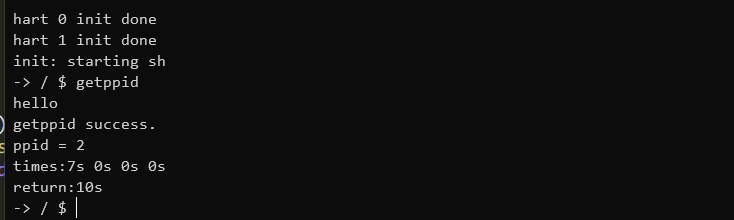

成功获取了父进程的pid，以及该进程的四个时间，显示为秒数。

### 任务2

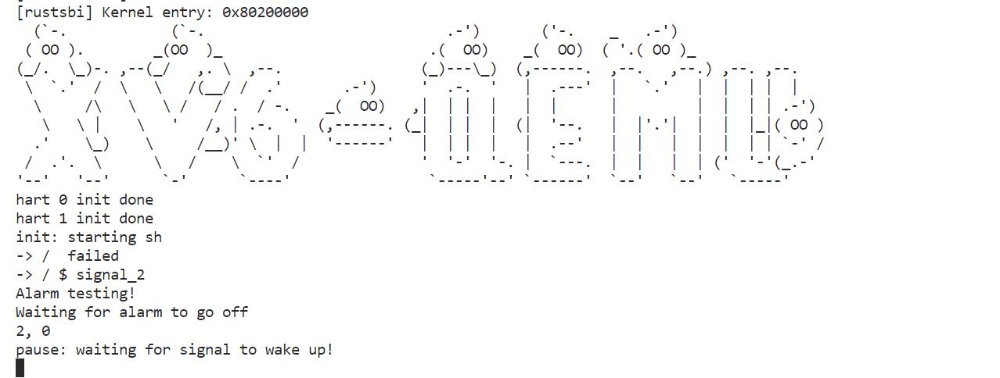

一开始会pause暂停一段时间，暂停结束后会打印出全部内容

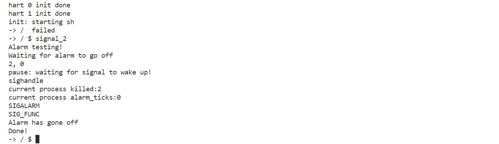

### 任务3

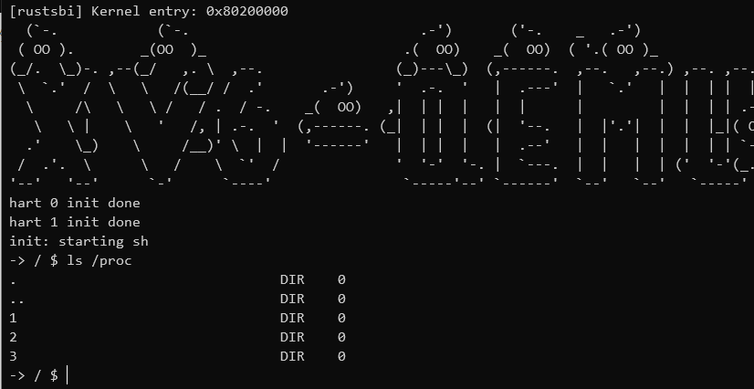

系统启动后，自动完成了`/proc`的挂载。`cd`和`ls`

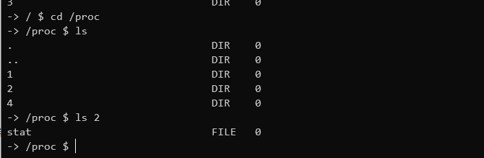

`cat`：

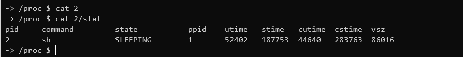

显示了进程的信息

### 任务4

默认ps和带参数的ps：

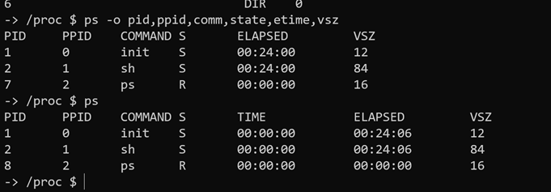

## 体会与思考

在这两周的实训中，我们通过一步一步的任务实现了一个简易的ps程序。期间我们理解了操作系统中时间的相关定义；通过xv6中多进程与linux中多线程进行对比，加深了对并发的理解；通过实现信号系统，理解了信号的传递与处理；对文件类几个系统调用的实现与使用使我们理解了操作系统ls查看一个目录需要进行哪些操作，cat一个文件需要经过哪些步骤；对ps的实现使这些内容综合起来形成了一个整体。  

回想这两周的实训，它让我从课堂走到实践，让我知道了我现在所学的东西是远远不够的，有些事在我实训以前认为是很简单的事情，可在这次实训中都显得很难，都不知道从何入手。经过这次实训，我们增加了对计算机系统层的兴趣。

